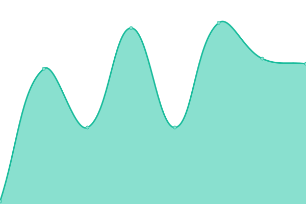
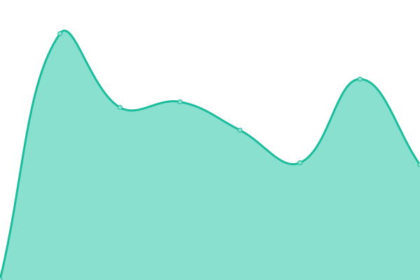
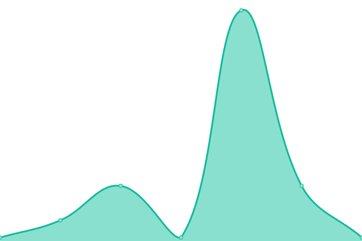
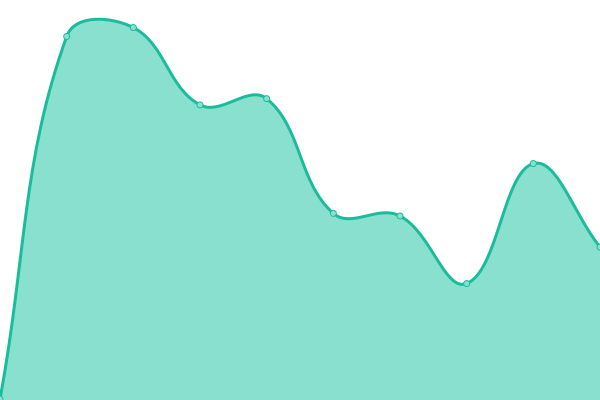
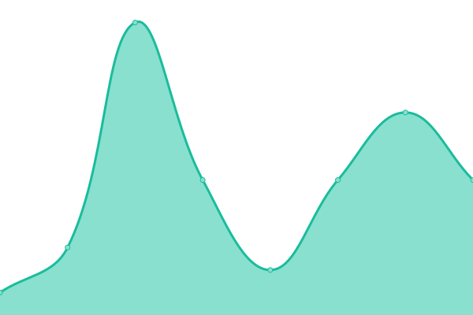
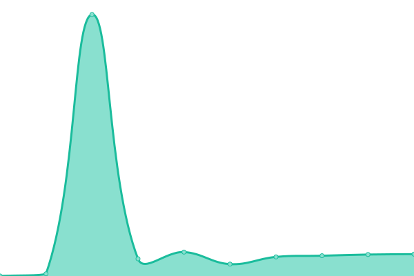
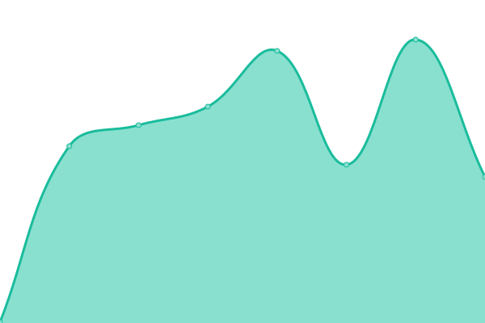
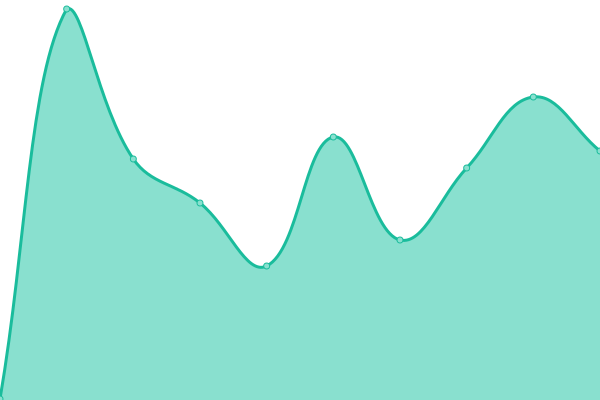
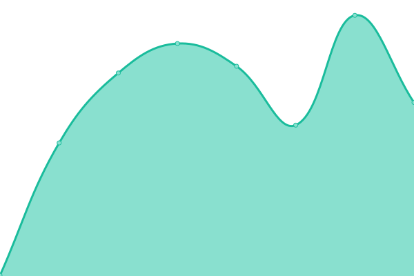

# [📈 Live Status](https://1337Nerd.github.io/uptime): <!--live status--> **🟧 Partial outage**

This repository contains the open-source uptime monitor and status page for [1337Nerd](https://1337Nerd.github.io/uptime), powered by [Upptime](https://github.com/upptime/upptime).

With [Upptime](https://upptime.js.org), you can get your own unlimited and free uptime monitor and status page, powered entirely by a GitHub repository. We use [Issues](https://github.com/1337Nerd/uptime/issues) as incident reports, [Actions](https://github.com/1337Nerd/uptime/actions) as uptime monitors, and [Pages](https://1337Nerd.github.io/uptime) for the status page.

<!--start: status pages-->
<!-- This summary is generated by Upptime (https://github.com/upptime/upptime) -->
<!-- Do not edit this manually, your changes will be overwritten -->
<!-- prettier-ignore -->
| URL | Status | History | Response Time | Uptime |
| --- | ------ | ------- | ------------- | ------ |
|  [Audiobookshelf](https://audio.joshuastock.net) | 🟩 Up | [audiobookshelf.yml](https://github.com/1337Nerd/uptime/commits/HEAD/history/audiobookshelf.yml) | 

 293ms
     
 | 

<a href="https://status.joshuastock.net/history/audiobookshelf">100.00%</a>
    

|  [Authentik](https://authentik.joshuastock.net) | 🟩 Up | [authentik.yml](https://github.com/1337Nerd/uptime/commits/HEAD/history/authentik.yml) | 

 429ms
     
 | 

<a href="https://status.joshuastock.net/history/authentik">100.00%</a>
    

|  [Authentik LDAP Outpost](ldap.joshuastock.net) | 🟩 Up | [authentik-ldap-outpost.yml](https://github.com/1337Nerd/uptime/commits/HEAD/history/authentik-ldap-outpost.yml) | 

 27ms
     
 | 

<a href="https://status.joshuastock.net/history/authentik-ldap-outpost">100.00%</a>
    

|  [Autobrr](https://autobrr.joshuastock.net) | 🟩 Up | [autobrr.yml](https://github.com/1337Nerd/uptime/commits/HEAD/history/autobrr.yml) | 

 368ms
     
 | 

<a href="https://status.joshuastock.net/history/autobrr">100.00%</a>
    

|  [Backrest](https://backrest.joshuastock.net) | 🟩 Up | [backrest.yml](https://github.com/1337Nerd/uptime/commits/HEAD/history/backrest.yml) | 

 340ms
     
 | 

<a href="https://status.joshuastock.net/history/backrest">100.00%</a>
    

|  [Backrest VPS](https://backrest-vps.joshuastock.net) | 🟩 Up | [backrest-vps.yml](https://github.com/1337Nerd/uptime/commits/HEAD/history/backrest-vps.yml) | 

 272ms
     
 | 

<a href="https://status.joshuastock.net/history/backrest-vps">99.58%</a>
    

|  [Bazarr](https://bazarr.joshuastock.net) | 🟩 Up | [bazarr.yml](https://github.com/1337Nerd/uptime/commits/HEAD/history/bazarr.yml) | 

 573ms
     
 | 

<a href="https://status.joshuastock.net/history/bazarr">100.00%</a>
    

|  [Code Server](https://code.joshuastock.net) | 🟩 Up | [code-server.yml](https://github.com/1337Nerd/uptime/commits/HEAD/history/code-server.yml) | 

 331ms
     
 | 

<a href="https://status.joshuastock.net/history/code-server">100.00%</a>
    

|  [Comfy](https://comfy.joshuastock.net) | 🟩 Up | [comfy.yml](https://github.com/1337Nerd/uptime/commits/HEAD/history/comfy.yml) | 

 295ms
     
 | 

<a href="https://status.joshuastock.net/history/comfy">100.00%</a>
    

|  [DNS Over HTTPS](https://doh.joshuastock.net/dns-query) | 🟥 Down | [dns-over-https.yml](https://github.com/1337Nerd/uptime/commits/HEAD/history/dns-over-https.yml) | 

 202ms
     
 | 

<a href="https://status.joshuastock.net/history/dns-over-https">0.00%</a>
    

|  [DNS Over TLS](dns.joshuastock.net) | 🟥 Down | [dns-over-tls.yml](https://github.com/1337Nerd/uptime/commits/HEAD/history/dns-over-tls.yml) | 

 0ms
     
 | 

<a href="https://status.joshuastock.net/history/dns-over-tls">0.00%</a>
    

|  [Feishin](https://music.joshuastock.net) | 🟩 Up | [feishin.yml](https://github.com/1337Nerd/uptime/commits/HEAD/history/feishin.yml) | 

 335ms
     
 | 

<a href="https://status.joshuastock.net/history/feishin">100.00%</a>
    

|  [Filebrowser](https://filebrowser.joshuastock.net) | 🟩 Up | [filebrowser.yml](https://github.com/1337Nerd/uptime/commits/HEAD/history/filebrowser.yml) | 

 298ms
     
 | 

<a href="https://status.joshuastock.net/history/filebrowser">100.00%</a>
    

|  [Firefox](https://firefox.joshuastock.net) | 🟩 Up | [firefox.yml](https://github.com/1337Nerd/uptime/commits/HEAD/history/firefox.yml) | 

 491ms
     
 | 

<a href="https://status.joshuastock.net/history/firefox">100.00%</a>
    

|  [Grafana](dashboard.joshuastock.net) | 🟩 Up | [grafana.yml](https://github.com/1337Nerd/uptime/commits/HEAD/history/grafana.yml) | 

 8ms
     
 | 

<a href="https://status.joshuastock.net/history/grafana">100.00%</a>
    

|  [Immich](https://immich.joshuastock.net) | 🟩 Up | [immich.yml](https://github.com/1337Nerd/uptime/commits/HEAD/history/immich.yml) | 

 309ms
     
 | 

<a href="https://status.joshuastock.net/history/immich">100.00%</a>
    

|  [Influx](https://influx.joshuastock.net) | 🟩 Up | [influx.yml](https://github.com/1337Nerd/uptime/commits/HEAD/history/influx.yml) | 

 305ms
     
 | 

<a href="https://status.joshuastock.net/history/influx">100.00%</a>
    

|  [Invoke AI](https://invoke.joshuastock.net) | 🟩 Up | [invoke-ai.yml](https://github.com/1337Nerd/uptime/commits/HEAD/history/invoke-ai.yml) | 

 341ms
     
 | 

<a href="https://status.joshuastock.net/history/invoke-ai">100.00%</a>
    

|  [Jellyfin](https://jellyfin.joshuastock.net) | 🟩 Up | [jellyfin.yml](https://github.com/1337Nerd/uptime/commits/HEAD/history/jellyfin.yml) | 

 462ms
     
 | 

<a href="https://status.joshuastock.net/history/jellyfin">99.03%</a>
    

|  [Jellyseerr](https://jellyseerr.joshuastock.net) | 🟩 Up | [jellyseerr.yml](https://github.com/1337Nerd/uptime/commits/HEAD/history/jellyseerr.yml) | 

 849ms
     
 | 

<a href="https://status.joshuastock.net/history/jellyseerr">99.59%</a>
    

|  [jfa-go](https://jfa-go.joshuastock.net) | 🟩 Up | [jfa-go.yml](https://github.com/1337Nerd/uptime/commits/HEAD/history/jfa-go.yml) | 

 288ms
     
 | 

<a href="https://status.joshuastock.net/history/jfa-go">100.00%</a>
    

|  [Karakeep](https://karakeep.joshuastock.net) | 🟥 Down | [karakeep.yml](https://github.com/1337Nerd/uptime/commits/HEAD/history/karakeep.yml) | 

 354ms
     
 | 

<a href="https://status.joshuastock.net/history/karakeep">0.00%</a>
    

|  [Navidrome](https://navidrome.joshuastock.net) | 🟩 Up | [navidrome.yml](https://github.com/1337Nerd/uptime/commits/HEAD/history/navidrome.yml) | 

 395ms
     
 | 

<a href="https://status.joshuastock.net/history/navidrome">100.00%</a>
    

|  [n8n](https://n8n.joshuastock.net) | 🟩 Up | [n8n.yml](https://github.com/1337Nerd/uptime/commits/HEAD/history/n8n.yml) | 

 266ms
     
 | 

<a href="https://status.joshuastock.net/history/n8n">99.73%</a>
    

|  [Ollama](https://ollama.joshuastock.net) | 🟩 Up | [ollama.yml](https://github.com/1337Nerd/uptime/commits/HEAD/history/ollama.yml) | 

 316ms
     
 | 

<a href="https://status.joshuastock.net/history/ollama">99.64%</a>
    

|  [Portainer](https://portainer.joshuastock.net) | 🟩 Up | [portainer.yml](https://github.com/1337Nerd/uptime/commits/HEAD/history/portainer.yml) | 

 262ms
     
 | 

<a href="https://status.joshuastock.net/history/portainer">100.00%</a>
    

|  [Portfolio](https://joshuastock.net) | 🟩 Up | [portfolio.yml](https://github.com/1337Nerd/uptime/commits/HEAD/history/portfolio.yml) | 

 122ms
     
 | 

<a href="https://status.joshuastock.net/history/portfolio">100.00%</a>
    

|  [Prowlarr](https://prowlarr.joshuastock.net) | 🟩 Up | [prowlarr.yml](https://github.com/1337Nerd/uptime/commits/HEAD/history/prowlarr.yml) | 

 396ms
     
 | 

<a href="https://status.joshuastock.net/history/prowlarr">100.00%</a>
    

|  [Radarr](https://radarr.joshuastock.net) | 🟩 Up | [radarr.yml](https://github.com/1337Nerd/uptime/commits/HEAD/history/radarr.yml) | 

 292ms
     
 | 

<a href="https://status.joshuastock.net/history/radarr">100.00%</a>
    

|  [Readarr](https://readarr.joshuastock.net) | 🟩 Up | [readarr.yml](https://github.com/1337Nerd/uptime/commits/HEAD/history/readarr.yml) | 

 290ms
     
 | 

<a href="https://status.joshuastock.net/history/readarr">100.00%</a>
    

|  [Romm](https://romm.joshuastock.net) | 🟥 Down | [romm.yml](https://github.com/1337Nerd/uptime/commits/HEAD/history/romm.yml) | 

 327ms
     
 | 

<a href="https://status.joshuastock.net/history/romm">0.00%</a>
    

|  [Slskd](https://slskd.joshuastock.net) | 🟩 Up | [slskd.yml](https://github.com/1337Nerd/uptime/commits/HEAD/history/slskd.yml) | 

 278ms
     
 | 

<a href="https://status.joshuastock.net/history/slskd">100.00%</a>
    

|  [Sonarr](https://sonarr.joshuastock.net) | 🟩 Up | [sonarr.yml](https://github.com/1337Nerd/uptime/commits/HEAD/history/sonarr.yml) | 

 305ms
     
 | 

<a href="https://status.joshuastock.net/history/sonarr">100.00%</a>
    

|  [Technitium](https://technitium.joshuastock.net) | 🟥 Down | [technitium.yml](https://github.com/1337Nerd/uptime/commits/HEAD/history/technitium.yml) | 

 167ms
     
 | 

<a href="https://status.joshuastock.net/history/technitium">0.00%</a>
    

|  [Torrent](https://torrent.joshuastock.net) | 🟩 Up | [torrent.yml](https://github.com/1337Nerd/uptime/commits/HEAD/history/torrent.yml) | 

 308ms
     
 | 

<a href="https://status.joshuastock.net/history/torrent">100.00%</a>
    

|  [Twitch](https://twitch.joshuastock.net) | 🟩 Up | [twitch.yml](https://github.com/1337Nerd/uptime/commits/HEAD/history/twitch.yml) | 

 351ms
     
 | 

<a href="https://status.joshuastock.net/history/twitch">100.00%</a>
    

|  [Umami](https://umami.joshuastock.net) | 🟩 Up | [umami.yml](https://github.com/1337Nerd/uptime/commits/HEAD/history/umami.yml) | 

 222ms
     
 | 

<a href="https://status.joshuastock.net/history/umami">100.00%</a>
    

|  [Webtop](https://arch.joshuastock.net) | 🟩 Up | [webtop.yml](https://github.com/1337Nerd/uptime/commits/HEAD/history/webtop.yml) | 

 326ms
     
 | 

<a href="https://status.joshuastock.net/history/webtop">100.00%</a>
    

|  [Whisper](https://whisper.joshuastock.net) | 🟩 Up | [whisper.yml](https://github.com/1337Nerd/uptime/commits/HEAD/history/whisper.yml) | 

 287ms
     
 | 

<a href="https://status.joshuastock.net/history/whisper">100.00%</a>
    

|  [Vaultwarden](https://vault.joshuastock.net) | 🟩 Up | [vaultwarden.yml](https://github.com/1337Nerd/uptime/commits/HEAD/history/vaultwarden.yml) | 

 210ms
     
 | 

<a href="https://status.joshuastock.net/history/vaultwarden">100.00%</a>
    

<!--end: status pages-->

[**Visit our status website →**](https://1337Nerd.github.io/uptime)

## 📄 License

- Powered by: [Upptime](https://github.com/upptime/upptime)
- Code: [MIT](./LICENSE) © [Anand Chowdhary](https://anandchowdhary.com), supported by [Pabio](https://pabio.com)
- Data in the `./history` directory: [Open Database License](https://opendatacommons.org/licenses/odbl/1-0/)
