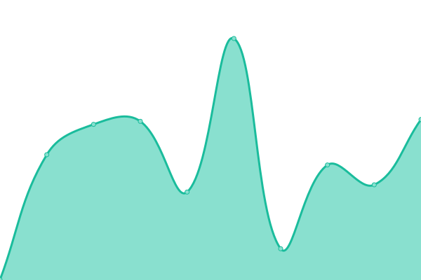

# [📈 Live Status](https://1337Nerd.github.io/uptime): <!--live status--> **🟩 All systems operational**

This repository contains the open-source uptime monitor and status page for [1337Nerd](https://1337Nerd.github.io/uptime), powered by [Upptime](https://github.com/upptime/upptime).

With [Upptime](https://upptime.js.org), you can get your own unlimited and free uptime monitor and status page, powered entirely by a GitHub repository. We use [Issues](https://github.com/1337Nerd/uptime/issues) as incident reports, [Actions](https://github.com/1337Nerd/uptime/actions) as uptime monitors, and [Pages](https://1337Nerd.github.io/uptime) for the status page.

<!--start: status pages-->
<!-- This summary is generated by Upptime (https://github.com/upptime/upptime) -->
<!-- Do not edit this manually, your changes will be overwritten -->
<!-- prettier-ignore -->
| URL | Status | History | Response Time | Uptime |
| --- | ------ | ------- | ------------- | ------ |
|  [Authentik](https://authentik.joshuastock.net) | 🟩 Up | [authentik.yml](https://github.com/1337Nerd/uptime/commits/HEAD/history/authentik.yml) | 

 407ms
     
 | 

<a href="https://upptime.joshuastock.net/history/authentik">100.00%</a>
    

|  [Dash](https://dash.joshuastock.net) | 🟩 Up | [dash.yml](https://github.com/1337Nerd/uptime/commits/HEAD/history/dash.yml) | 

 291ms
     
 | 

<a href="https://upptime.joshuastock.net/history/dash">99.69%</a>
    

|  [Filebrowser](https://filebrowser.joshuastock.net) | 🟩 Up | [filebrowser.yml](https://github.com/1337Nerd/uptime/commits/HEAD/history/filebrowser.yml) | 

 268ms
     
 | 

<a href="https://upptime.joshuastock.net/history/filebrowser">99.69%</a>
    

|  [Grafana](dashboard.joshuastock.net) | 🟩 Up | [grafana.yml](https://github.com/1337Nerd/uptime/commits/HEAD/history/grafana.yml) | 

 4ms
     
 | 

<a href="https://upptime.joshuastock.net/history/grafana">100.00%</a>
    

|  [Homarr](https://homarr.joshuastock.net) | 🟩 Up | [homarr.yml](https://github.com/1337Nerd/uptime/commits/HEAD/history/homarr.yml) | 

 657ms
     
 | 

<a href="https://upptime.joshuastock.net/history/homarr">99.69%</a>
    

|  [Invoke AI](https://invoke.joshuastock.net) | 🟩 Up | [invoke-ai.yml](https://github.com/1337Nerd/uptime/commits/HEAD/history/invoke-ai.yml) | 

 511ms
     
 | 

<a href="https://upptime.joshuastock.net/history/invoke-ai">100.00%</a>
    

|  [Jellyfin](https://jellyfin.joshuastock.net) | 🟩 Up | [jellyfin.yml](https://github.com/1337Nerd/uptime/commits/HEAD/history/jellyfin.yml) | 

 282ms
     
 | 

<a href="https://upptime.joshuastock.net/history/jellyfin">99.49%</a>
    

|  [Jellyseerr](https://jellyseerr.joshuastock.net) | 🟩 Up | [jellyseerr.yml](https://github.com/1337Nerd/uptime/commits/HEAD/history/jellyseerr.yml) | 

 560ms
     
 | 

<a href="https://upptime.joshuastock.net/history/jellyseerr">99.69%</a>
    

|  [jfa-go](https://jfa-go.joshuastock.net) | 🟩 Up | [jfa-go.yml](https://github.com/1337Nerd/uptime/commits/HEAD/history/jfa-go.yml) | 

 255ms
     
 | 

<a href="https://upptime.joshuastock.net/history/jfa-go">55.63%</a>
    

|  [Ollama](https://ollama.joshuastock.net) | 🟩 Up | [ollama.yml](https://github.com/1337Nerd/uptime/commits/HEAD/history/ollama.yml) | 

 247ms
     
 | 

<a href="https://upptime.joshuastock.net/history/ollama">99.69%</a>
    

|  [Portainer](https://portainer.joshuastock.net) | 🟩 Up | [portainer.yml](https://github.com/1337Nerd/uptime/commits/HEAD/history/portainer.yml) | 

 205ms
     
 | 

<a href="https://upptime.joshuastock.net/history/portainer">99.69%</a>
    

|  [Portfolio](https://joshuastock.net) | 🟩 Up | [portfolio.yml](https://github.com/1337Nerd/uptime/commits/HEAD/history/portfolio.yml) | 

 89ms
     
 | 

<a href="https://upptime.joshuastock.net/history/portfolio">100.00%</a>
    

|  [Prowlarr](https://prowlarr.joshuastock.net) | 🟩 Up | [prowlarr.yml](https://github.com/1337Nerd/uptime/commits/HEAD/history/prowlarr.yml) | 

 277ms
     
 | 

<a href="https://upptime.joshuastock.net/history/prowlarr">100.00%</a>
    

|  [Radarr](https://radarr.joshuastock.net) | 🟩 Up | [radarr.yml](https://github.com/1337Nerd/uptime/commits/HEAD/history/radarr.yml) | 

 293ms
     
 | 

<a href="https://upptime.joshuastock.net/history/radarr">100.00%</a>
    

|  [Slskd](https://slskd.joshuastock.net) | 🟩 Up | [slskd.yml](https://github.com/1337Nerd/uptime/commits/HEAD/history/slskd.yml) | 

 254ms
     
 | 

<a href="https://upptime.joshuastock.net/history/slskd">100.00%</a>
    

|  [Sonarr](https://sonarr.joshuastock.net) | 🟩 Up | [sonarr.yml](https://github.com/1337Nerd/uptime/commits/HEAD/history/sonarr.yml) | 

 268ms
     
 | 

<a href="https://upptime.joshuastock.net/history/sonarr">100.00%</a>
    

|  [Syncthing](https://syncthing.joshuastock.net) | 🟩 Up | [syncthing.yml](https://github.com/1337Nerd/uptime/commits/HEAD/history/syncthing.yml) | 

 204ms
     
 | 

<a href="https://upptime.joshuastock.net/history/syncthing">99.69%</a>
    

|  [Torrent](https://torrent.joshuastock.net) | 🟩 Up | [torrent.yml](https://github.com/1337Nerd/uptime/commits/HEAD/history/torrent.yml) | 

 220ms
     
 | 

<a href="https://upptime.joshuastock.net/history/torrent">99.69%</a>
    

|  [Transmission](https://transmission.joshuastock.net) | 🟩 Up | [transmission.yml](https://github.com/1337Nerd/uptime/commits/HEAD/history/transmission.yml) | 

 274ms
     
 | 

<a href="https://upptime.joshuastock.net/history/transmission">100.00%</a>
    

|  [Twitch](https://twitch.joshuastock.net) | 🟩 Up | [twitch.yml](https://github.com/1337Nerd/uptime/commits/HEAD/history/twitch.yml) | 

 226ms
     
 | 

<a href="https://upptime.joshuastock.net/history/twitch">99.69%</a>
    

|  [Webtop](https://arch.joshuastock.net) | 🟩 Up | [webtop.yml](https://github.com/1337Nerd/uptime/commits/HEAD/history/webtop.yml) | 

 264ms
     
 | 

<a href="https://upptime.joshuastock.net/history/webtop">100.00%</a>
    

|  [Webtop VPN](https://vpn.joshuastock.net) | 🟩 Up | [webtop-vpn.yml](https://github.com/1337Nerd/uptime/commits/HEAD/history/webtop-vpn.yml) | 

 237ms
     
 | 

<a href="https://upptime.joshuastock.net/history/webtop-vpn">100.00%</a>
    

<!--end: status pages-->

[**Visit our status website →**](https://1337Nerd.github.io/uptime)

## 📄 License

- Powered by: [Upptime](https://github.com/upptime/upptime)
- Code: [MIT](./LICENSE) © [Anand Chowdhary](https://anandchowdhary.com), supported by [Pabio](https://pabio.com)
- Data in the `./history` directory: [Open Database License](https://opendatacommons.org/licenses/odbl/1-0/)
