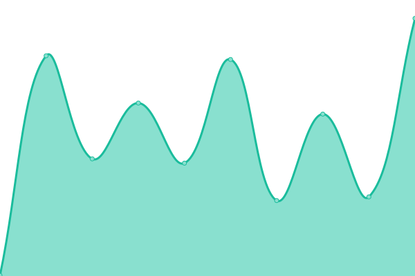

# [📈 Live Status](https://1337Nerd.github.io/uptime): <!--live status--> **🟧 Partial outage**

This repository contains the open-source uptime monitor and status page for [1337Nerd](https://1337Nerd.github.io/uptime), powered by [Upptime](https://github.com/upptime/upptime).

With [Upptime](https://upptime.js.org), you can get your own unlimited and free uptime monitor and status page, powered entirely by a GitHub repository. We use [Issues](https://github.com/1337Nerd/uptime/issues) as incident reports, [Actions](https://github.com/1337Nerd/uptime/actions) as uptime monitors, and [Pages](https://1337Nerd.github.io/uptime) for the status page.

<!--start: status pages-->
<!-- This summary is generated by Upptime (https://github.com/upptime/upptime) -->
<!-- Do not edit this manually, your changes will be overwritten -->
<!-- prettier-ignore -->
| URL | Status | History | Response Time | Uptime |
| --- | ------ | ------- | ------------- | ------ |
|  [Authentik](https://authentik.joshuastock.net) | 🟩 Up | [authentik.yml](https://github.com/1337Nerd/uptime/commits/HEAD/history/authentik.yml) | 

 280ms
     
 | 

<a href="https://1337Nerd.github.io/uptime/history/authentik">100.00%</a>
    

|  [Filebrowser](https://filebrowser.joshuastock.net) | 🟩 Up | [filebrowser.yml](https://github.com/1337Nerd/uptime/commits/HEAD/history/filebrowser.yml) | 

 136ms
     
 | 

<a href="https://1337Nerd.github.io/uptime/history/filebrowser">22.97%</a>
    

|  [Grafana](https://dashboard.joshuastock.net) | 🟥 Down | [grafana.yml](https://github.com/1337Nerd/uptime/commits/HEAD/history/grafana.yml) | 

 145ms
     
 | 

<a href="https://1337Nerd.github.io/uptime/history/grafana">0.07%</a>
    

|  [Jellyfin](https://jellyfin.joshuastock.net) | 🟩 Up | [jellyfin.yml](https://github.com/1337Nerd/uptime/commits/HEAD/history/jellyfin.yml) | 

 164ms
     
 | 

<a href="https://1337Nerd.github.io/uptime/history/jellyfin">16.53%</a>
    

|  [Portainer](https://portainer.joshuastock.net) | 🟩 Up | [portainer.yml](https://github.com/1337Nerd/uptime/commits/HEAD/history/portainer.yml) | 

 223ms
     
 | 

<a href="https://1337Nerd.github.io/uptime/history/portainer">100.00%</a>
    

|  [Portfolio](https://joshuastock.net) | 🟩 Up | [portfolio.yml](https://github.com/1337Nerd/uptime/commits/HEAD/history/portfolio.yml) | 

 110ms
     
 | 

<a href="https://1337Nerd.github.io/uptime/history/portfolio">17.29%</a>
    

|  [Syncthing](https://syncthing.joshuastock.net) | 🟩 Up | [syncthing.yml](https://github.com/1337Nerd/uptime/commits/HEAD/history/syncthing.yml) | 

 174ms
     
 | 

<a href="https://1337Nerd.github.io/uptime/history/syncthing">30.26%</a>
    

|  [Torrent](https://torrent.joshuastock.net) | 🟩 Up | [torrent.yml](https://github.com/1337Nerd/uptime/commits/HEAD/history/torrent.yml) | 

 221ms
     
 | 

<a href="https://1337Nerd.github.io/uptime/history/torrent">100.00%</a>
    

|  [Twitch](https://twitch.joshuastock.net) | 🟩 Up | [twitch.yml](https://github.com/1337Nerd/uptime/commits/HEAD/history/twitch.yml) | 

 217ms
     
 | 

<a href="https://1337Nerd.github.io/uptime/history/twitch">100.00%</a>
    

<!--end: status pages-->

[**Visit our status website →**](https://1337Nerd.github.io/uptime)

## 📄 License

- Powered by: [Upptime](https://github.com/upptime/upptime)
- Code: [MIT](./LICENSE) © [Anand Chowdhary](https://anandchowdhary.com), supported by [Pabio](https://pabio.com)
- Data in the `./history` directory: [Open Database License](https://opendatacommons.org/licenses/odbl/1-0/)
